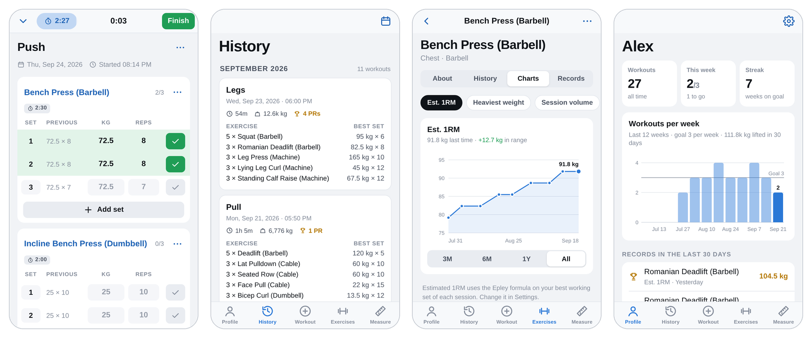

<p align="center">
  
</p>

<h1 align="center">Setlog</h1>

<p align="center">
  A free, open-source workout tracker for the gym.<br>
  Log your sets, see what you lifted last time, and watch your numbers go up.
</p>

<p align="center">
  <a href="https://laurinlibossek.github.io/setlog/"><strong>Open the app</strong></a> ·
  <a href="#install-it-on-your-phone">Install</a> ·
  <a href="#features">Features</a> ·
  <a href="#how-its-built">How it's built</a>
</p>

<p align="center">
  <picture>
    <source media="(prefers-color-scheme: dark)" srcset="docs/screenshots-dark.png">
    
  </picture>
</p>

## Why Setlog

Most workout trackers lock their best features behind a subscription or want an account before you log a single set. Setlog doesn't do either:

- **Completely free.** There's no subscription, no ads and no premium tier.
- **Private.** There's no account and no server. Your training log is stored on your phone and never uploaded.
- **Works offline.** It opens instantly and keeps working in a basement gym with no signal.
- **iPhone and Android.** Add it to your home screen from the browser and it runs full-screen like a native app.
- **Open source.** It's MIT-licensed and small enough to read in an afternoon.

## Features

**Logging**
- Every set shows what you did last time. Tap ✓ on an empty set to reuse those numbers.
- Weight × reps, bodyweight (plain, weighted or assisted), reps only, distance and time for cardio, and time for holds like planks.
- Warm-up, drop and failure sets, RPE, notes per exercise, and pinned notes ("seat on 4").
- Supersets, reordering, swapping exercises, swipe to delete with undo, and a warm-up set generator.
- A rest timer starts when you finish a set, with per-exercise defaults, ±15 s and skip.

**Routines**
- Save workouts as templates and sort them into folders.
- Six ready-made examples to start with (Push/Pull/Legs, 5×5, Full Body). You can hide them once you have your own.
- If a workout differs from its template, Setlog asks whether to update the template.

**Progress**
- New personal records are flagged the moment you set them and summed up after each workout.
- Each exercise gets charts for estimated 1RM (Epley or Brzycki), heaviest weight, volume and reps. It also lists your records, your best weight for every rep count and your full history.
- History shows as a list or a calendar. You can edit past workouts, repeat them or turn them into templates.
- A weekly goal with a streak. Body weight, body fat, calories and 13 body measurements, each with a chart.

**Exercises**
- About 190 built-in exercises with forgiving search: "db bench" finds *Bench Press (Dumbbell)*.
- Add your own exercises, merge duplicates and hide the ones you never do.

**Your data**
- Backup and restore as a single file you can keep in iCloud Drive, Google Drive or anywhere else.
- CSV export for spreadsheets, R or Python.
- Import your history from Strong, including custom exercises and set types ([see below](#coming-from-another-app)).

**And more**
- kg or lb, km or mi, light and dark mode, a plate calculator and a 1RM calculator. The screen stays on during a workout.

## Install it on your phone

Open **[laurinlibossek.github.io/setlog](https://laurinlibossek.github.io/setlog/)** on your phone, then:

| Phone | Browser | Steps |
|---|---|---|
| iPhone | Safari | Share → **Add to Home Screen** |
| Android | Chrome | ⋮ menu → **Install app** (or *Add to Home screen*) |
| Samsung | Samsung Internet | ≡ menu → **Add page to** → **Home screen** |

From then on, open Setlog from the new icon. The installed app keeps its own storage, separate from the browser tab, so log your workouts there.

## Coming from another app?

You don't need any other app to use Setlog. But if you've been tracking with **Strong**, you can bring your whole history along:

1. In Strong, go to **Settings → Export Workouts** and save the CSV file.
2. In Setlog, go to **Profile → ⚙︎ → Import from Strong** and pick the file.
3. Check the preview (workouts, sets, date range, new exercises) and confirm.

Exercises that share a name with a built-in one are matched automatically. Everything else becomes a custom exercise, including the ones you created yourself. If you import the same file twice, workouts you already have are skipped.

## Your data

Your workouts are stored on your device in IndexedDB. Nothing is uploaded and nothing is tracked. Nobody else can see your workouts, not even whoever hosts the app.

The flip side is that backups are up to you. Use **Settings → Back up now** every so often (the app reminds you every two weeks), and always before deleting the home screen icon or switching phones. **Restore from backup** brings everything back.

## Known limits

- Phones pause web apps while they're locked, so the rest timer can't alert you with the phone in your pocket. It keeps counting correctly, and while the screen is on (the default during a workout) it beeps when your rest is over. Android also vibrates. On iPhone, the beep needs the ring/silent switch set to ring.
- There's no sync between devices. Use backup and restore to move your data.
- There's no Apple Health, Google Fit or smartwatch integration yet.

## Host your own copy

Setlog is a folder of static files, so any static host can serve it. With GitHub Pages:

1. Fork this repository.
2. In your fork, open **Settings → Pages** and set **Source** to **GitHub Actions**.
3. The included workflow publishes the `setlog/` folder to `https://<your-username>.github.io/setlog/` on every push to `main`.

When you change the app, bump `VERSION` in `setlog/sw.js`. Installed copies then show "A new version of Setlog is ready" and update with one tap.

## How it's built

Setlog is a Progressive Web App written as plain JavaScript modules. There's no build step and nothing to install; the only libraries are two tiny ones vendored into the repo.

- **UI:** Preact and htm, vendored in `setlog/js/vendor/` (about 17 KB).
- **Storage:** IndexedDB with automatic reconnect, because iOS Safari drops idle database connections. The workout in progress is also mirrored to localStorage, so it survives the app being closed mid-set.
- **Offline:** a service worker caches the whole app on install and offers new versions through an in-app prompt.
- **Units and input:** data is stored in kg, km and seconds and converted for display. Number inputs accept decimal commas ("62,5").
- **Records:** a single chronological pass over the history works out the personal records for every set (estimated 1RM, weight, set volume, reps, distance and time).
- **Import:** a CSV parser that handles both of Strong's export layouts, comma or semicolon delimiters, warm-up/drop/failure sets and rest-timer rows, and skips duplicates.
- **Testing:** end-to-end tests in an emulated iPhone browser (Playwright). They cover a real 86-workout import, backup round-trips and starting offline.
- Developed with the assistance of Claude (Anthropic).

```
setlog/                        the app (this folder is what gets deployed)
├── index.html                 app shell
├── manifest.webmanifest       home screen install (with icons/)
├── sw.js                      offline cache and updates
├── css/app.css                styles, light and dark
└── js/
    ├── app.js                 entry: tabs, wake lock, theme, updates
    ├── store.js, db.js        state, persistence and all data actions
    ├── calc.js                1RM, volume, records, plates, warm-ups
    ├── editor.js, sheet.js    workout logging and rest timer
    ├── io.js                  import, export, backup
    ├── seed.js                built-in exercises and example templates
    └── screens/               Workout, History, Exercises, Measure, Profile
.github/workflows/pages.yml    deploys setlog/ to GitHub Pages
docs/                          screenshots for this README
```

### Run it locally

```sh
git clone https://github.com/laurinlibossek/setlog.git
cd setlog/setlog
python3 -m http.server 8000
```

Then open http://localhost:8000.

## Background

Setlog started as a personal replacement for a paid tracker. I wanted every feature I actually used, my full history in open formats and no monthly fee. It turned out useful enough to share, so now it's free and open source for anyone who trains.

## Contributing

Found a bug or missing a feature? Open an issue. Pull requests are welcome too. Please keep the app dependency-free with no build step, and try your change on a real phone.

## License

[MIT](LICENSE) © 2026 Laurin Libossek. The bundled libraries are Preact (MIT) and htm (Apache 2.0), and their licenses are in `setlog/js/vendor/`.

Setlog is an independent project and isn't affiliated with Strong or any other workout app.
